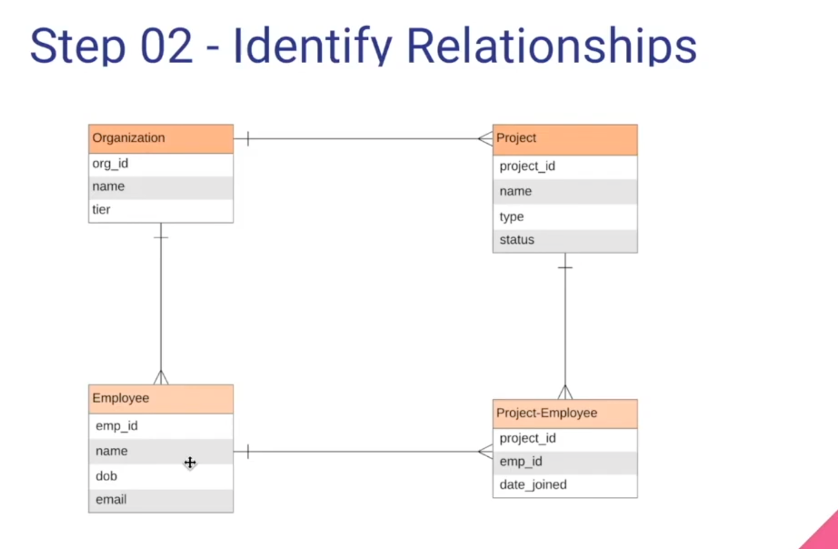
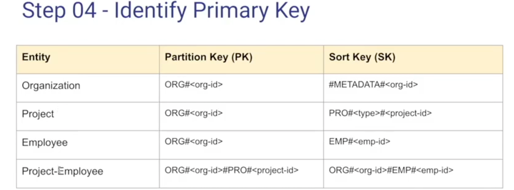
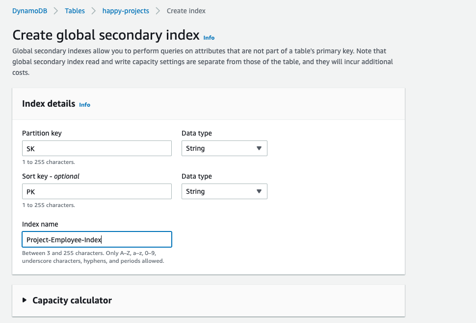
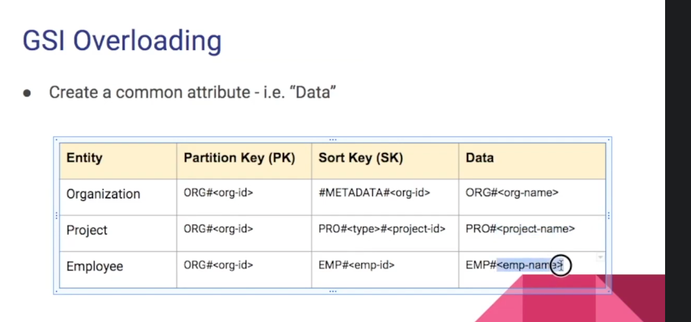
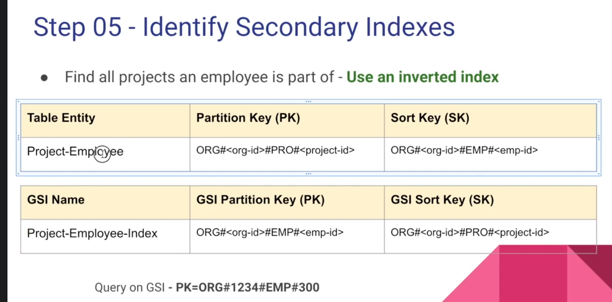
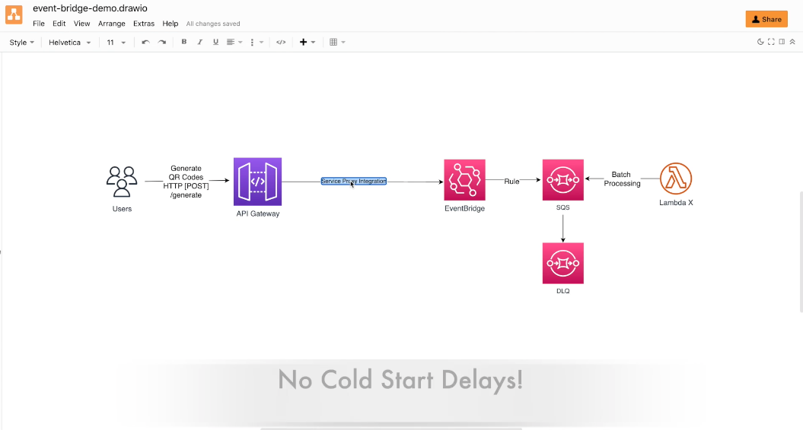

# 100days-of-codeV2


#### Day 1 Dynamo Starter
> Dynamo DB Inverted Index Research + CRUD with Deep Index Understanding 
> Conrinue on Udemy Course [The Complete Guide to Build Serverless Applications on AWS](https://allylearning.udemy.com/course/building-rest-apis-with-serverless) 
> Relationship


> Inverted Index

> Overload

> Secondary Index

#### Day 2 Serverless Framework API GW 
> Serverless  [Setup](https://www.serverless.com/framework/docs/providers/aws/guide/credentials/)  
> Conrinue on Udemy Course [The Complete Guide to Build Serverless Applications on AWS](https://allylearning.udemy.com/course/building-rest-apis-with-serverless) 
> Timeout issues DynamoDB
> Helpfull Commands
```bash
serveress create -t aws-nodejs (Start Project)
```
> Helpful notes
```
ConditionExpression: "attribute_not_exists(hashkey)" - allows not to use duplicates
ConditionExpression: "attribute_exists(hashkey)" - allows not to update ONLY if exists 

context.callbackWaitsForEmptyEventLoop = false – Set to false to send the response right away when the callback runs, instead of waiting for the Node.js event loop to be empty. If this is false, any outstanding events continue to run during the next invocation.

```
> Links 
```
Reusing connections (DynamoDB) : https://docs.aws.amazon.com/sdk-for-javascript/v2/developer-guide/node-reusing-connections.html
How to fix DynamoDB timeouts in Serverless apps : https://seed.run/blog/how-to-fix-dynamodb-timeouts-in-serverless-application.html
```

####  Day 3  Serverless authorizer and user pools 
> If you pass in context of authorizer value then you can share it to event of lambda of incoming request
```javascript

// in authorizer 
  authReponse.context = {
    foo: "bar",
  };
// in lambda of incoming request
event.requestContext.authorizer.foo // === "bar"  
```
>Links and notes
```
Amazon Cognito Hosted UI : https://docs.aws.amazon.com/cognito/latest/developerguide/cognito-user-pools-app-integration.html 
https://<your_domain>/login?response_type=token&client_id=<your_app_client_id>&redirect_uri=<your_callback_url>

<!-- Example calling cognito -->
https://ddzmitryauth-production.auth.us-east-1.amazoncognito.com/login?response_type=token&client_id=40gtgdr5epltjsl3r1msrsm8vl&redirect_uri=http://localhost:3000 

Example callback
http://localhost:3000/#id_token=SOMECOOLJWTTOKEN&expires_in=3600&token_type=Bearer


```

####  Day 4  Serverless Using Environment Variables and Setting up github actions
```bash
# To get serverless Starter for github actions https://github.com/marketplace?type=&verification=&query=serverless+ 
# to remove resources 
sls remove
sls remove --stage demo
```

####  Day 5  Testing with Jest and Caching on API GW 
> Gotcha API GW authorizer caches session and need to be set TTL to equal 0 , that way we can  test requests properly. (bad fix )
> https://aws.amazon.com/premiumsupport/knowledge-center/api-gateway-lambda-authorization-errors/ ( GOOD fix)

```javascript
// "arn:aws:execute-api:<region>:<account>:<API_id>/<stage>/<http-method>/[<resource-path-name>/[<child-resources-path>]"
    const tmp = event.methodArn.split(':');
    const apiGatewayArnTmp = tmp[5].split('/');

    // Create wildcard resource
    const resource = tmp[0] + ":" + tmp[1] + ":" + tmp[2] + ":" + tmp[3] + ":" + tmp[4] + ":" + apiGatewayArnTmp[0] + '/*/*'; 
```

#### Day 6 TS configuration for serverless libraries 
```
  "devDependencies": {
    "dotenv": "^16.0.3",
    "jest": "^29.3.1",
    "lodash": "^4.17.21",
    "serverless-iam-roles-per-function": "^3.2.0",
    "serverless-plugin-typescript": "^2.1.4",
    "typescript": "^4.9.3"
  }
```

#### Day 7 Event Bridge 
```json
// Payload example rule that will be going to EventBridge 
{
  "version": "0",
  "id": "2ead7826-ff14-191c-535d-f717c385dc92",
  "detail-type": "orderCreated",
  "source": "my-ecommerce-app",
  "account": "197480905965",
  "time": "2022-12-03T21:44:09Z",
  "region": "us-east-1",
  "resources": [],
  "detail": {
    "orderId": 100,
    "quantity": 10
  }
}
// Rule that we can apply
//  Run rule for every event where source === "my-ecommerce-app" && detail-type === "orderCreated" && quantity > 5
{
  "source": ["my-ecommerce-app"],
  "detail-type": ["orderCreated"],
  "detail": {
    "quantity": [ { "numeric": [ ">", 5 ] } ]
  }
}
```
> Use npx to start project `npx sls create --template aws-nodejs` and to deploy `npx sls deploy`
> SQS - Visibility Timeout !Important (Recommended visibility timeout for SQS = 6 X Lambda Timeout) 
```
When a consumer receives and processes a message from a queue, the message remains in the queue. Amazon SQS doesn't automatically delete the message. Because Amazon SQS is a distributed system, there's no guarantee that the consumer actually receives the message (for example, due to a connectivity issue, or due to an issue in the consumer application). Thus, the consumer must delete the message from the queue after receiving and processing it.
```
```
If
Lambda Time Out - 6s
And
MaximumBatchingWindow - 5s
Then:
Visibility Timeout =  6*6s + 5 = 41s
```
> Look into ReportBatchItemFailures
> API GW serverless Policy Alloews to directly push data to EventBus

```bash
npx serverless plugin install -n serverless-apigateway-service-proxy
```
#### Day 8 Serverless Step Funcitons
> https://states-language.net/ (State Language)
> https://github.com/serverless-operations/serverless-step-functions (sls plugin)
```
npx serverless plugin install -n serverless-step-functions
```
```json
// Field match IMPORTANT

// Payload
{
    "bookid": "100",
  	"quantity": 10
}
// Expectations
// module.exports.checkInventory = async ({ bookid, quantity }) 

```
#### Day 8 Serverless Step Funcitons Wrap Up